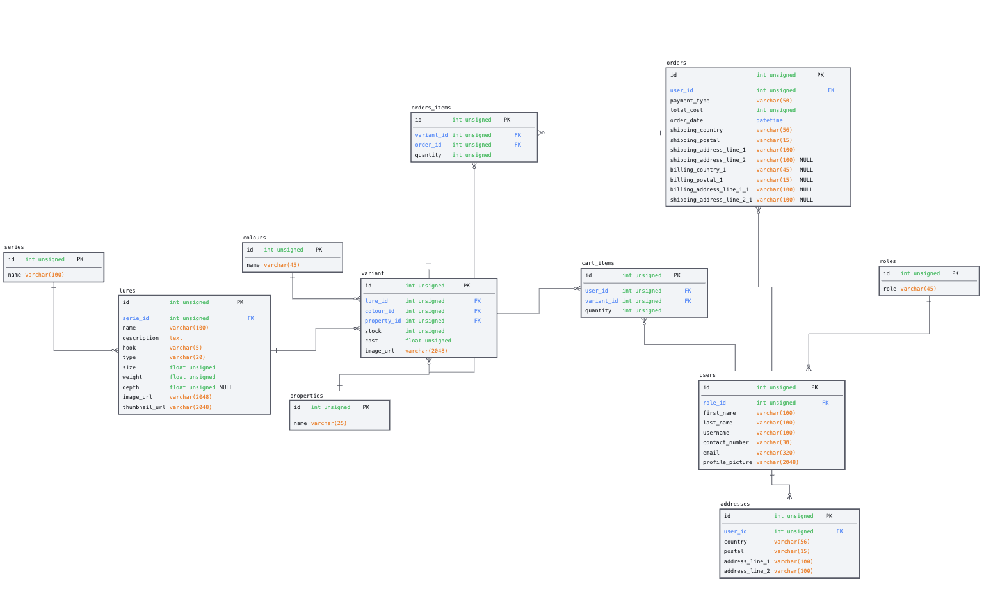

## Project Overview

Zerek is an online store dedicated to selling fishing lures and related products. The store aims to provide fishing enthusiasts with a convenient and user-friendly shopping experience for all their lure needs. Whether customers are beginners or experienced anglers, the Ecommerce Lure Store offers a wide range of high-quality lures from various brands to cater to their preferences and fishing styles.

### Test Accounts

Live demo for customers can be accessed here.

- Test Account:
  -Email: dog@dog.com  
  -Password: dog

Live demo for admin/shop owners can be accessed here.

-Test Account:
-Email: kitty@kittyman.com  
-Password: Kitty@123

## Features

The Ecommerce Shop includes the following key features:

1. **Product Catalog**: The shop offers a wide range of products that customers can browse and search for.

2. **User Accounts**: Customers can create accounts, log in, and manage their profiles, including order history and shipping addresses.

3. **Shopping Cart**: Customers can add products to their shopping cart, update quantities, and proceed to checkout.

4. **Checkout Process**: The shop provides a secure checkout process, allowing customers to enter shipping and payment information.

5. **Order Management**: Administrators have access to an order management system to process orders, update order status, and manage inventory.

## Tech Stack

The Ecommerce Shop is built using the following technologies:

- **Front-end**: HTML, CSS, JavaScript, React, Tailwind, Framer Motion

- **Back-end**: Node.js with express, JSON Web Token, CORS (Cross-Origin Resource Sharing), Bookshelf (ORM Library), Knex (SQL Query Builder), Cloudinary, Caolan Forms, Moment, Handlebars

- **Database**: MySQL for testing, PostgreSQL for deployment

- **Payment Gateway**: Integrated Stripe for secure online transactions.

- **Hosting**: [Render](www.render.com) for backend, [Netlify](www.netlify.com) for frontend.
